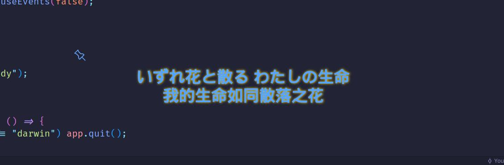
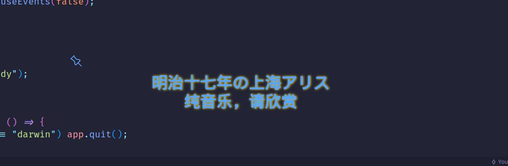

# YPMDL - YesPlayMusic Desktop Lyrics

一个依赖YesPlayMusic的悬浮歌词。Work In Progress。

**自己用的，自己用的，自己用的。**

**仅限Linux**

## 为什么要做这个项目

~~写代码的时候不听歌，就像四大名著不读红楼梦、方便面不吃白象、手机不用华为、游戏不玩原神，说明这个人的摸鱼造诣不足，他理解不了这种潜移默化的高级摸鱼，他只能看到屏幕上的代码，参不透其中摸鱼划水的内涵，他整个人的层次就卡在这里了，只能度过一个相对失败的人生。~~
~~而听歌的时候没有了悬浮歌词和翻译，就像西方失去了耶路撒冷、德国丢掉了丹尼斯堡、罗马没有了君士坦丁堡，只会永远陷入无限的悲伤，失去了人生的意义，前途只有一片黑暗。~~

草。

我纵贯Linux各个网易云的客户端，多少都有些缺憾，不是没有悬浮歌词，就是悬浮歌词没有翻译，要么两个都没有。
写代码的时候vscode-netease-music倒是有这些功能，但是字太小了。YesPlayMusic原先有悬浮歌词的，在后面的版本中被去掉了。YesPlayMusicOSD这个fork倒是有悬浮歌词的功能，不过说实话，不好看，丑，而且悬浮窗碍事，而且好像几个月没更新了还。

那用外挂悬浮歌词呢？OSDLyrics可以选择Netease和Netease Translated的来源，但是似乎只能够二选一，还不好看。Sunamu不错，但是老问题，只有歌词，没有翻译，而且同样的，悬浮窗碍事，作者好像还不维护了。

坏了，这下子能用的一个都没有了。那就自己写一个。

顺带着，严厉批判歌词悬浮窗不带翻译的野蛮行为。

## Why Electron?

因为这几天晚上熬夜熬多了，脑子不够清醒。

于是乎早上起来半梦半醒学一两个小时的Electron就开始搞了。

嗯，然后写JavaScript会给人带来不幸。

## 嫖来的部分

歌词显示部分中，**严重参考**https://github.com/shih-liang/YesPlayMusicOSD 中的部分代码。

## build && run

没啥复杂的依赖，随便build一下应该就好了。

没啥要注意的，随便run一下应该就好了。

不过都说了是依赖yesplaymusic的是吧，这玩意就是配套用的

## Examples

窗口能够用鼠标拖动的呢，好厉害！

看到左上角那个图钉没？点一下，窗口就能够固定住啦！好厉害哦！~~坏消息是，暂时取消不掉。~~

## 亲爱的bug们

**大量bug，海量bug，巨大多bug。**

现在用的话可能会引发的bug包括但不限于歌词不能够正常显示、程序卡死、格式错乱、时间轴错乱~~、重新滚Arch、电脑爆炸、太阳氦闪、三体人入侵~~等。

目前最主要的问题是electron的`BrowserWindow.setIgnoreMouseEvent()`API中的`forward`选项在Linux下无法使用，导致窗口锁定之后无法解锁。暂时考虑通过一些奇技淫巧来把这个问题给修掉。

## LICENSE

就这还要License？想他*干啥就干啥。
