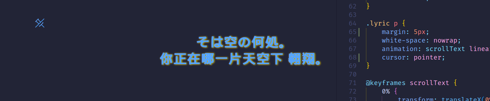

# YADL - Yet Another Desktop Lyrics

YADL is a simple desktop lyrics application that displays lyrics on your linux desktop. It is written with Rust and Tauri.

## Features

- Get current playing song from MPRIS compatible media players. 
  - Once your media player is MPRIS compatible, YADL can get the current playing song from it.
- Display lyrics on your desktop (if your media player gives the lyrics).
  - Currently, we only support lyrics from YesPlayMusic.
  - More lyrics sources will be supported in the future.
- Features which a desktop lyrics application should have.

### Screenshots

Desktop lyrics, with a transparent background and a `pin` button.




Support pure music / music without lyrics yet:


## Installation

Not yet :(

## Complication

First, make sure you have all the dependencies installed. You can find the dependencies in the [tauri documentation](https://tauri.app/v1/guides/getting-started/prerequisites#setting-up-linux).

Then, clone the repository and run the following commands:

```bash
npm install
```

To run the application in development mode, you can run:

```bash
npm run tauri dev
```

To build the application, you can run:

```bash
cd src-tauri
cargo tauri build
```

This should work.

## Troubleshooting

### Wayland

Yes, under wayland, we may encounter many problems, such as
- Window decoration elements are not hidden (title bar and black frame).
- `always on top` does not work.
- Floating window following cannot be implemented, which will destroy the function of locking the lyrics window.

These problems originate from the implementation of the upstream library, so we don't have a suitable solution for the time being and can only wait for upstream updates.

As an alternative, **using x11 (XWayland) may be a valid solution**.

Currently, under develop mode, we can pass such environment variables to force the application to use x11:

```bash
WEBKIT_DISABLE_COMPOSITING_MODE=1 GDK_BACKEND=x11 npm run tauri dev
```

### Blur Frame

Sometimes, a strange problem may occur: sometimes the window will be displayed with a blur frame. We are not sure what causes this problem, but we think it also comes from the upstream library.

After testing, this problem has a high probability of occurring under Wayland and a very small probability under X11.

Sadly, there's no solution for this problem yet. Restart the application may help.

### Yesplaymusic Compatibility

We noticed that the yesplaymusic installed in Ubuntu's snap source is a very old version (0.4.5?), which does not implement the MPRIS interface. When you use an older version, YADL may not work correctly.

For normal use, please make sure you have a newer version installed.